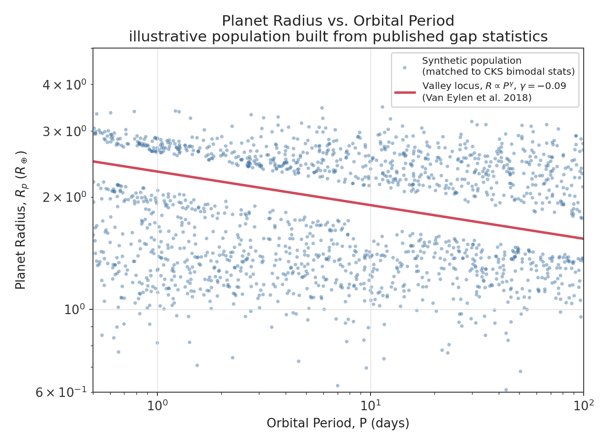
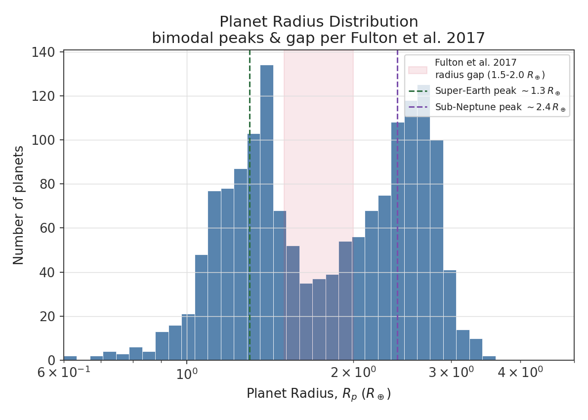
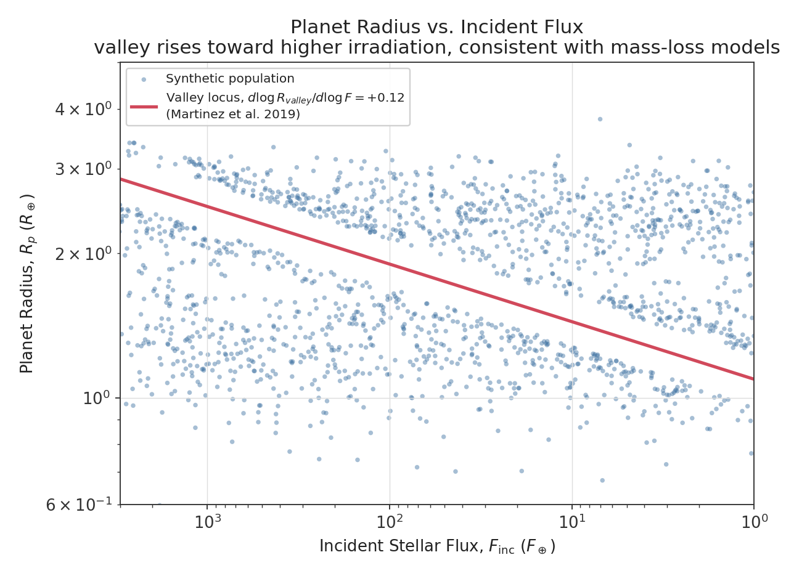
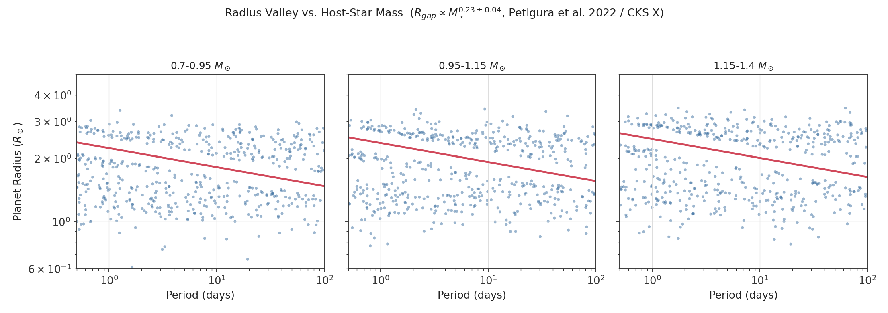

# Exoplanet Radius Valley

### A statistical and physical investigation of the super-Earth / sub-Neptune transition

<p align="center">

[](#research-status)
[](#software-stack)
[](#methodology)
[](#observational-dataset)
[](#license)

</p>

---

## Abstract

The observed population of small, close-in exoplanets exhibits a pronounced deficit in planetary radii between the **super-Earth** and **sub-Neptune** regimes — the **exoplanet radius valley** (or "Fulton gap"), first resolved at high significance by [Fulton et al. 2017](https://arxiv.org/abs/1703.10375) using the California-Kepler Survey. It is now one of the most important observational constraints on close-in planet formation and atmospheric evolution.

This project treats the radius valley as a **multidimensional population phenomenon** rather than a single radius–period correlation, and asks how its position and shape depend on stellar mass, metallicity, age, and incident irradiation — the signature that competing atmospheric-loss mechanisms are expected to leave behind.

> **How does the location and structure of the exoplanet radius valley depend on stellar properties, orbital environment, and incident stellar irradiation, and what can these dependencies reveal about atmospheric mass-loss mechanisms?**

---

## Contents

- [Research Question](#research-question)
- [Scientific Motivation](#scientific-motivation)
- [Preview: What the Pipeline Reproduces](#preview-what-the-pipeline-reproduces)
- [Observational Dataset](#observational-dataset)
- [Statistical Framework](#statistical-framework)
- [Selection Effects](#selection-effects)
- [Research Hypotheses](#research-hypotheses)
- [Methodology](#methodology)
- [Repository Structure](#repository-structure)
- [Software Stack](#software-stack)
- [Key Literature](#key-literature)
- [Research Status](#research-status)
- [Citation](#citation)

---

## Research Question

$$
R_{\rm valley}
=
f\left(
P,\,
F_{\rm inc},\,
M_\star,\,
[\mathrm{Fe/H}],\,
T_{\rm eff},\,
{\rm Age}
\right)
$$

| Symbol | Quantity |
|---|---|
| $R_{\rm valley}$ | characteristic radius of the population gap |
| $P$ | planetary orbital period |
| $F_{\rm inc}$ | incident stellar flux |
| $M_\star$ | stellar mass |
| $[\mathrm{Fe/H}]$ | stellar metallicity |
| $T_{\rm eff}$ | stellar effective temperature |
| Age | stellar age |

Rather than asking only *whether* the radius valley exists, this project investigates **how its position and morphology change across different planetary and stellar environments.**

---

## Scientific Motivation

$$
\boxed{\text{Super-Earths}}
\qquad
\longleftrightarrow
\qquad
\boxed{\text{Sub-Neptunes}}
$$

Planets are thought to begin with substantial gaseous (H/He) envelopes and subsequently lose part or all of that envelope, carving a valley in the radius distribution between bare rocky cores and gas-enveloped planets. Two mechanisms dominate the discussion:

**Photoevaporation** — high-energy (X-ray/EUV) stellar radiation heats and drives off a planet's atmosphere on ~10–100 Myr timescales ([Owen & Wu 2013](https://arxiv.org/abs/1303.3899); [Lopez & Fortney 2013](https://arxiv.org/abs/1311.0329)):

$$
\dot M
\sim
\frac{
\epsilon \pi R_{\rm XUV}^{3}F_{\rm XUV}
}{
G M_p K_{\rm tide}
}
$$

**Core-powered mass loss** — the planet's own primordial internal heat, radiated over ~1 Gyr timescales, is sufficient to unbind a low-mass envelope even without stellar irradiation driving it ([Ginzburg, Schlichting & Sari 2018](https://arxiv.org/abs/1801.06740); [Gupta & Schlichting 2019](https://arxiv.org/abs/1811.03202)).

The two mechanisms make **related but distinguishable predictions** for how the valley should move with $M_p, R_p, P, F_{\rm inc}, T_{\rm eq},$ and stellar age — which is exactly the multidimensional signal this project is built to test.

---

## Preview: What the Pipeline Reproduces

The figures below are **not** pulled from any paper's plots, nor from a live archive query (this environment has no network access to query the NASA Exoplanet Archive directly). They are synthetic populations generated from the **published summary statistics** — bimodal peak locations, gap slopes, and occurrence trends reported in the literature — so that the README has a concrete, quantitatively grounded preview of what `src/radius_valley/` will regenerate from the real `PSCompPars` catalog once the data pipeline (currently 🟡 in progress) is run. Every number baked into these illustrations is cited inline and in [Key Literature](#key-literature).

### Radius vs. orbital period, with the empirical valley locus



**Figure 1.** Illustrative population with the valley locus $R\propto P^{\gamma}$, $\gamma=-0.09^{+0.02}_{-0.04}$, as measured by [Van Eylen et al. 2018](https://arxiv.org/abs/1710.05398) from asteroseismic host-star radii. The negative slope is a signature consistent with photoevaporation-driven mass loss.

### Radius distribution: the Fulton gap



**Figure 2.** Bimodal radius distribution with peaks at $\sim1.3\,R_\oplus$ and $\sim2.4\,R_\oplus$ and a gap spanning $1.5$–$2.0\,R_\oplus$, per [Fulton et al. 2017](https://arxiv.org/abs/1703.10375).

### Radius vs. incident flux



**Figure 3.** The valley's radius rises toward higher irradiation, $d\log R_{\rm valley}/d\log F_{\rm inc} = +0.12\pm0.02$, per [Martinez et al. 2019](https://arxiv.org/abs/1903.00174) — the flux-space counterpart to the negative period slope in Figure 1.

### Radius valley vs. host-star mass



**Figure 4.** The valley shifts to larger radii around more massive stars, $R_{\rm valley}\propto M_\star^{0.23\pm0.04}$ ([Petigura et al. 2022, CKS X](https://arxiv.org/abs/2201.08370)), driven mostly by the sub-Neptune population growing with $M_\star^{0.25\pm0.03}$ while the super-Earth population stays roughly flat ($M_\star^{0.02\pm0.03}$).

---

## Observational Dataset

The primary dataset is the **NASA Exoplanet Archive Planetary Systems Composite Parameters (`PSCompPars`) table**, the archive's recommended table for statistical population studies (superseding the retired legacy *Confirmed Planets* table).

| Quantity | Symbol | Unit |
|---|---:|---:|
| Planet radius | $R_p$ | $R_\oplus$ |
| Planet mass | $M_p$ | $M_\oplus$ |
| Orbital period | $P$ | days |
| Semi-major axis | $a$ | AU |
| Stellar mass | $M_\star$ | $M_\odot$ |
| Stellar radius | $R_\star$ | $R_\odot$ |
| Stellar temperature | $T_{\rm eff}$ | K |
| Stellar metallicity | $[\mathrm{Fe/H}]$ | dex |
| Stellar age | $t_\star$ | Gyr |

> **Data integrity principle:** no numerical population figure in this repository will be presented as an observational result unless it can be regenerated from the documented data query and analysis pipeline. Figures 1–4 above are explicitly flagged as illustrations, not results, until the live pipeline runs.

### Derived quantities

$$
F_{\rm inc} = \frac{L_\star}{4\pi a^2}
\qquad\qquad
T_{\rm eq} = T_\star \left(\frac{R_\star}{2a}\right)^{1/2}(1-A)^{1/4}
$$

---

## Statistical Framework

| Stage | Goal |
|---|---|
| **I. Descriptive** | characterize $p(R_p, P)$ for the observed sample |
| **II. Valley estimation** | fit $R_{\rm valley}(P)$ (e.g. via the Gap-Bin or SVM methods used in the literature) |
| **III. Environmental dependence** | fit $R_{\rm valley} = f(P, F_{\rm inc}, M_\star, [\rm Fe/H], T_{\rm eff}, t_\star)$ |
| **IV. Uncertainty propagation** | incorporate measurement errors in $R_p$, $M_\star$, $a$, etc. |
| **V. Model comparison** | compare photoevaporation vs. core-powered mass loss vs. gas-poor formation using formal statistical criteria, not visual agreement |

---

## Selection Effects

Transit surveys preferentially detect planets that are larger, closer to their host stars, and orbiting stars favorable for detection, so

$$
p_{\rm observed}(R_p,P) \neq p_{\rm intrinsic}(R_p,P).
$$

This project treats selection effects as first-class, explicitly modeling: detection biases, radius/stellar-parameter uncertainties, period-dependent completeness, and heterogeneity across discovery missions — rather than attributing every feature of the observed distribution to astrophysics.

---

## Research Hypotheses

**H₁ — Irradiation dependence:** $\partial R_{\rm valley}/\partial F_{\rm inc} \neq 0$.

**H₂ — Stellar dependence:** $R_{\rm valley} \neq f(P)$ alone; instead $R_{\rm valley}=f(P,M_\star,[\rm Fe/H],T_{\rm eff},\ldots)$.

**H₃ — Atmospheric evolution:** the population structure carries signatures consistent with post-formation atmospheric mass loss, not solely primordial (gas-poor) formation.

**H₄ — Competing mechanisms:** photoevaporation and core-powered mass loss predict distinguishable population-level trends (see the slope table in [Key Literature](#key-literature)) that observational demographics can help discriminate between.

---

## Methodology

```text
                 NASA Exoplanet Archive
                          │
                          ▼
                ┌───────────────────┐
                │ Data Acquisition   │
                └─────────┬─────────┘
                          │
                          ▼
                ┌───────────────────┐
                │ Quality Filtering  │
                └─────────┬─────────┘
                          │
                          ▼
                ┌───────────────────┐
                │ Derived Physics    │
                │  F_inc, T_eq,      │
                │  orbital quantities│
                └─────────┬─────────┘
                          │
                          ▼
                ┌───────────────────┐
                │ Population Model  │
                └─────────┬─────────┘
                          │
              ┌───────────┴───────────┐
              ▼                       ▼
       Radius Valley             Demographics
              │                       │
              └───────────┬───────────┘
                          ▼
                ┌───────────────────┐
                │ Statistical Tests │
                └─────────┬─────────┘
                          │
                          ▼
                ┌───────────────────┐
                │ Physical Models   │
                └─────────┬─────────┘
                          │
                          ▼
                ┌───────────────────┐
                │ Scientific Result │
                └───────────────────┘
```

**Reproducibility pipeline:**

$$
\boxed{\text{Raw Data} \rightarrow \text{Processing} \rightarrow \text{Analysis} \rightarrow \text{Figure}}
$$

No manually edited scientific figures will be used in the final analysis; every figure is generated from code in this repository.

---

## Repository Structure

```text
exoplanet-radius-valley/
│
├── README.md
├── LICENSE
├── pyproject.toml
├── .gitignore
│
├── src/radius_valley/
│   ├── data/            download.py · cleaning.py · validation.py
│   ├── physics/         stellar.py · orbital.py · irradiation.py · mass_loss.py
│   ├── analysis/        radius_valley.py · demographics.py · statistics.py
│   ├── visualization/   population.py · valley.py
│   └── utils/           constants.py · config.py
│
├── notebooks/
│   ├── 01_data_exploration.ipynb
│   ├── 02_radius_valley.ipynb
│   ├── 03_stellar_dependence.ipynb
│   ├── 04_irradiation_analysis.ipynb
│   └── 05_mass_loss_models.ipynb
│
├── data/{raw,interim,processed}/
├── results/{figures,tables,models}/
├── tests/  test_data.py · test_physics.py · test_statistics.py
├── docs/   literature/ · methodology/ · research_notes/
└── paper/  figures/ · tables/ · manuscript/
```

---

## Software Stack

**Scientific Python** — Python, NumPy, SciPy, Pandas, Matplotlib, Astropy, Astroquery
**Statistics** — scikit-learn, PyMC, ArviZ
**Development** — Jupyter, pytest, Ruff, Git

The stack is intentionally modular so statistical models can be swapped without rewriting the physical or data-processing layers.

---

## Key Literature

| Paper | Key result used here |
|---|---|
| [Fulton et al. 2017, AJ 154, 109](https://arxiv.org/abs/1703.10375) | First high-significance detection of the bimodal radius gap (peaks $\sim1.3$, $\sim2.4\,R_\oplus$; gap $1.5$–$2.0\,R_\oplus$) using CKS spectroscopic stellar radii |
| [Van Eylen et al. 2018, MNRAS 479, 4786](https://arxiv.org/abs/1710.05398) | Asteroseismic confirmation; valley slope $\gamma = -0.09^{+0.02}_{-0.04}$ in $R\propto P^\gamma$ |
| [Martinez et al. 2019, ApJ 881, 19](https://arxiv.org/abs/1903.00174) | Valley slope in flux space, $d\log R_{\rm valley}/d\log F_{\rm inc}=+0.12\pm0.02$; CKS stellar/planetary parameter re-derivation |
| [Owen & Wu 2013, ApJ 775, 105](https://arxiv.org/abs/1303.3899) / [2017, ApJ 847, 29](https://arxiv.org/abs/1705.10810) | Photoevaporation model predictions for the valley |
| [Lopez & Fortney 2013, ApJ 776, 2](https://arxiv.org/abs/1311.0329) | Envelope mass-loss models linking $R_p$, $F_{\rm inc}$, and age |
| [Ginzburg, Schlichting & Sari 2018, MNRAS 476, 759](https://arxiv.org/abs/1801.06740) | Core-powered mass-loss mechanism |
| [Gupta & Schlichting 2019, MNRAS 487, 24](https://arxiv.org/abs/1811.03202) | Core-powered mass-loss population predictions, incl. slope estimates |
| [Petigura et al. 2022, AJ 163, 179 (CKS X)](https://arxiv.org/abs/2201.08370) | Stellar-mass dependence, $R_{\rm valley}\propto M_\star^{0.23\pm0.04}$, and separate super-Earth / sub-Neptune $M_\star$ scaling |
| [Berger et al. 2020, AJ 160, 108 (CKS VII)](https://arxiv.org/abs/2005.14671) | Gaia DR2 stellar radii; confirms and refines the $M_\star$-dependence of the gap |
| [Ho & Van Eylen 2023, MNRAS 519, 4056](https://arxiv.org/abs/2301.04062) | Deeper valley from Kepler short-cadence photometry; slope $-0.096^{+0.023}_{-0.027}$ |
| [Rogers, Owen & collaborators, e.g. Rogers et al. 2021](https://arxiv.org/abs/2007.11006) | Framework for population-level model comparison between photoevaporation and core-powered mass loss |

**Slope predictions by mechanism** (from the compilation in [Rogers et al. 2020, ApJ 947, L19](https://arxiv.org/abs/1912.02170)), where $d\log r_p/d\log P$ and $d\log r_p/d\log F$ describe how the valley moves:

| Mechanism | $d\log r_p/d\log P$ | $d\log r_p/d\log F$ |
|---|---:|---:|
| Gas-poor formation | $+0.11$ | $-0.08$ |
| Photoevaporation | $-0.15$ | $+0.11$ |
| Core-powered mass loss | $-0.13$ | $+0.10$ |
| Impact erosion | $-0.33$ | $+0.25$ |
| **Observed (Sun-like hosts)** | $-0.09$ to $-0.11$ | $+0.12$ |

Distinguishing these mechanisms — and testing whether more than one operates in different regimes — is the empirical target of Stage V of the [Statistical Framework](#statistical-framework).

---

## Research Status

| Component | Status |
|---|---|
| Research question | 🟢 Defined |
| Repository architecture | 🟢 Defined |
| Literature review | 🟡 In progress |
| Data pipeline | 🟡 In progress |
| Radius-valley baseline | 🔴 Pending |
| Irradiation analysis | 🔴 Pending |
| Stellar dependence | 🔴 Pending |
| Statistical model | 🔴 Pending |
| Mass-loss comparison | 🔴 Pending |
| Manuscript | 🔴 Pending |

---

## Scientific Philosophy

1. **Physics before machine learning.** ML may assist nonlinear inference eventually, but it will not replace physical reasoning.
2. **Statistical significance before visual significance.** A feature visible in a plot is not automatically an astrophysical discovery.
3. **Reproducibility before novelty.** Every claimed result should trace: $\text{dataset} \rightarrow \text{code} \rightarrow \text{analysis} \rightarrow \text{figure} \rightarrow \text{conclusion}$.

---

## Expected Contributions

1. Whether the radius valley's location depends measurably on host-star properties.
2. Whether irradiation provides explanatory power beyond orbital period alone.
3. How strongly observational selection effects influence the measured valley.
4. Whether different stellar populations exhibit statistically distinguishable radius distributions.
5. Which observational trends are most consistent with competing atmospheric-loss mechanisms.

The goal is not simply to reproduce the existence of the radius valley, but to determine whether its **multidimensional structure contains additional information about planetary evolution**.

---

## Citation

If this repository contributes to published research, please cite the corresponding paper together with the NASA Exoplanet Archive dataset (DOI **10.26133/NEA1**), per the archive's [current citation guidance](https://exoplanetarchive.ipac.caltech.edu/docs/counts_detail.html), and the primary literature in [Key Literature](#key-literature) for any adopted slope or scaling relation.

---

## License

Released under the [MIT License](LICENSE).

<p align="center">
<i>From observed population structure to planetary atmospheric evolution.</i>
</p>
